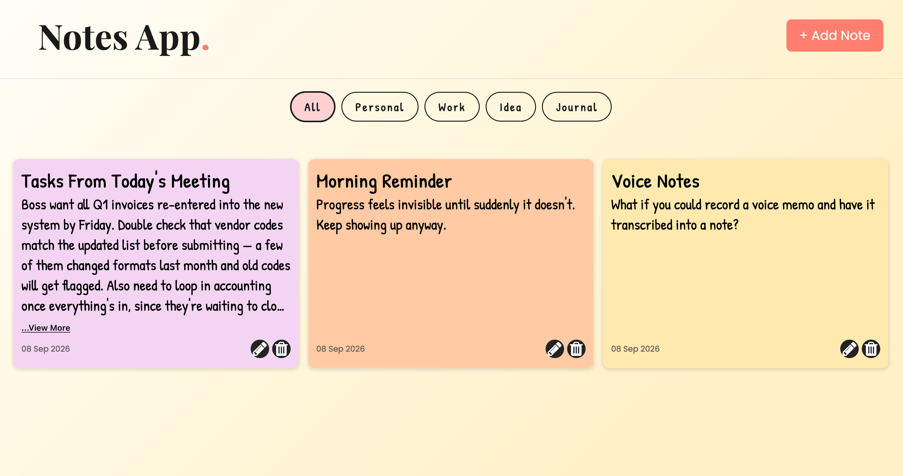

<div style="text-align: center;">
    
</div>

# Notes App

A full-stack notes app with full CRUD functionality. It's built with React + TypeScript on the frontend, Node.js/Express on the backend, and PostgreSQL (hosted on Neon) for persistence. Originally built as a vanilla JavaScript app, then migrated to a typed React architecture.

## Live Demo

[View Site](https://notes-app-jsadd.netlify.app/)

## Features

- Create, edit, and delete notes with a title, body, and category
- Filter notes by category, with dynamic category-colored UI
- Collapsible/expandable note cards with automatic overflow detection (only shows "View More" when text actually overflows)
- Persistent storage via a PostgreSQL database
- User-facing error handling for failed network requests
- Responsive grid layout

## Tech Stack

- **Frontend:** React, TypeScript, Vite, CSS
- **Backend:** Node.js, Express
- **Database:** PostgreSQL (Neon, serverless)
- **Deployment:** Netlify (frontend), Render (backend)

## Architecture

```
frontend/          React + TypeScript app (Vite)
  src/
    components/    Header, FilterBar, Note, NoteModal, NotesContainer, ErrorBanner
    context/       NotesContext (shared state, avoids prop drilling)

server.js          Express API (CRUD routes for /notes)
config/db.js       PostgreSQL connection pool (via pg)
```

**API Endpoints:**
| Method | Route | Description |
|--------|-------|-------------|
| GET | `/notes` | Fetch all notes |
| GET | `/notes/:id` | Fetch a single note |
| POST | `/notes` | Create a note |
| PUT | `/notes/:id` | Update a note |
| DELETE | `/notes/:id` | Delete a note |

## Running Locally

**Backend:**

```bash
npm install
npm run dev
```

**Frontend:**

```bash
cd frontend
npm install
npm run dev
```

# How it can be improved

- add message confirming if you would like to delete a card
- add auth to the project so database can be unique for each viewer
- add markdown or better formatting to the notes so bullets and headings can be featured
